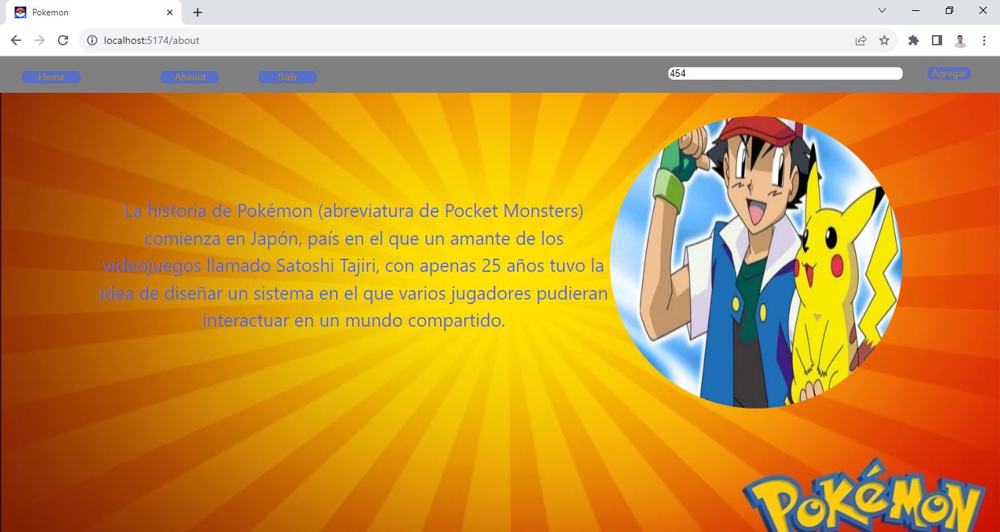

<h1>Api de Pokemon<h1>

 

 
<h1>Descripción de la Aplicación:</h1>

Se ha trabajado en la API de Pokémon, donde iniciamos con un formulario que contiene la opción para iniciar sesión. Desde ahí, nos lleva al home, donde podemos buscar y agregar Pokémon diferentes mediante su ID. También podemos ver detalles sobre cada Pokémon. Además, contamos con una sección 'about' que narra una pequeña historia de Pokémon

